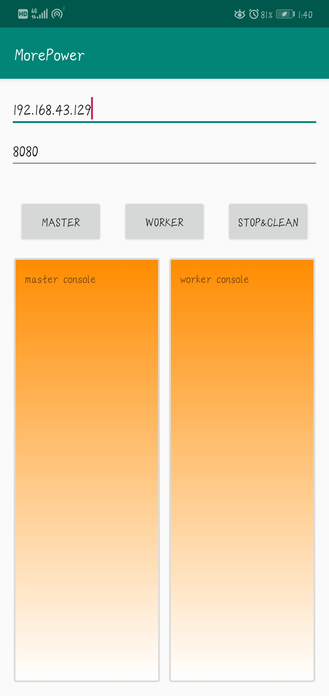

> 此项目已转移到[https://github.com/HERO5/SparkDroid](https://github.com/HERO5/SparkDroid)

# MorePower

Hi! 这是一款开源android应用，我想通过它来实现移动端的分布式任务处理，且具有去中心化、免配置、易使用的特点。因为目前所有的分布式框架都是基于pc的，配置复杂，且对服务器的环境有一定的要求。虽然android也是基于Linux的系统，但封印了好多功能，尤其是root权限的限制，导致普通android手机不能直接部署现有分布式框架。

# 使用说明

目前此app的功能非常简单，只是一原型，实现了简单的任务下发和任务提交功能，使用时一定要在**同一局域网下！！！**。下面是使用步骤：

- Step1: master端输入master启动端口

>master的IP固定为127.0.0.1，修改无效；端口任意，只要是未被占用就行。

- Step2: 点击MASTER按钮以启动“工头”

>点击一次master之后会生成十个任务，等待Worker的任务请求。

- Step3: worker端输入master的IP和端口

>再次申明，IP必须填局域网IP，因为手机运营商不允许我们直接p2p。

- Step4: 点击WORKER按钮以启动一个“工人”

 

>每点击一下WORKER就会生成一个worker，worker的端口是自动分配的。master端当然也可以启动自己的worker，这时IP可以填127.0.0.1，也可以填局域网下的IP。

- Step5: 点击STOP&CLEAN以关闭本地所有master和worker并清理控制台

 

# 运行流程

- 流程非常简单，就是普通的tcp通信，然后自己写了个处理逻辑。以线程为单位，线程之间的通信流程如下：

- 如果没有任务了：

>ps: 下面对技术的讨论，都是根据自己的理解，存在很多错误，希望能得到批评指正

# 使用的技术及存在的问题
### 设备间通信
- 使用netty实现了tcp通信，问题在于，只能在同一个局域网下实现p2p。因为移动上网时，是先连到运营商（如联通）的大局域网再通过网关转到公网，手机分配的IP是10.xx.xx.xx，并不是公网IP。解决办法还是像QQ一样，搞个服务器，但是这样又违背了初衷--去中心化。
### 任务下发和部署
- 先说问题，现在有很多优秀的分布式框架，比如strom，spark，flink，他们是将任务按照框架约定好的模式用高级语言封装起来，比如hadoop支持上传jar包作为任务，然后将jar部署到worker。之前我也想过在android上部署jar包，但是需要将jar转换成dex格式才能在android上动态加载执行，这可能就需要中间服务器进行格式转换，而我想做到尽量的实时，中间服务器将会是累赘，所以不能采取jar包的方式。(现在也有一些android版的javac、java工具，可惜我还没研究透，用不了)
- 最后我选择python作为任务的载体，现在有许多比较成熟的android版python环境，比如SL4A(Scripting Layer for Android)、CLE、Chaquopy，它们都提供了python在android上运行的方案(效率方面我还没有做比较)，其中Chaquopy可以很方便的引入第三方库(如numpy，我觉得引入tensorflow应该也不成问题)。
### 任务拆分和执行模式
- 任务拆分虽然是重中之重，但是还没做。。。现在是点击MASTER一下就生成十个任务。
- 执行模式方面，我比较了解的是storm(其实都不咋了解:))，他使用计算图的形式，制作一个流水线，这样效率会非常高，适合实时任务的处理。可惜我目前的能力还不能复刻出一套这种模式，现在是直接执行master下发的代码，毫无效率可言。。。以后再说吧，先弄个原型出来。

>由于本人技术较渣，就不说太多了

# 目标
- 情境一：有天你想玩个配置要求超高的游戏，但硬件不允许，这时，你打开一个服务，向附近的哥们发起援助请求，说我想借一下你们的手机cpu，只需有数个同意的，就可以将游戏运行时产生的计算任务分配给“租借”到的cpu，达到提高计算性能的目的。
- 情景二：有天闲着无聊，想自己训练个能说说话的机器人，假设数据源得到了，自己的算法也实现了，缺发现没有合适的设备跑，买个云服务又太贵。于是就开始了骚操作···
>感觉想的有点多了。。。慢慢搞吧，说不定就有了突破呢
